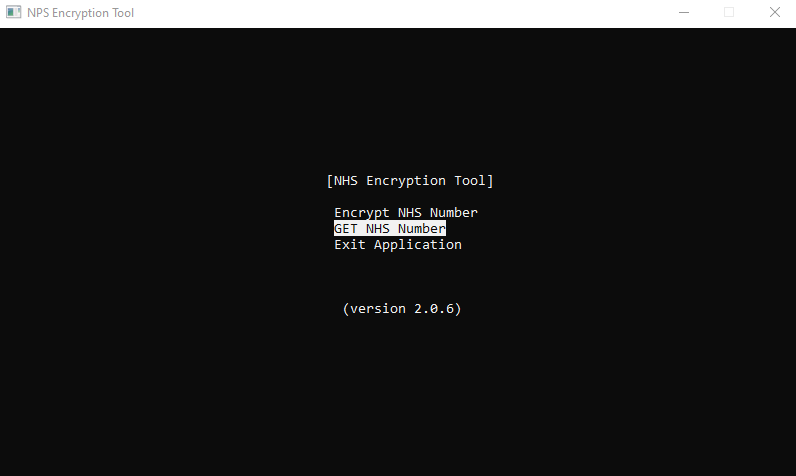
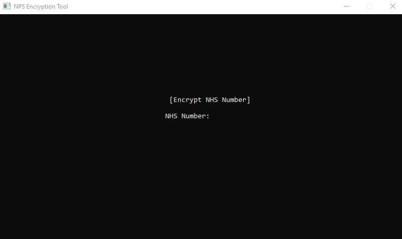
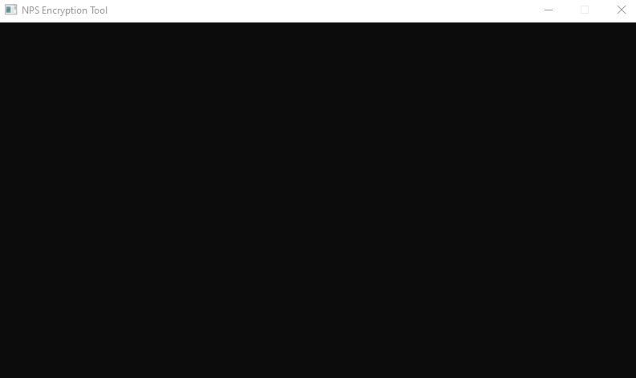
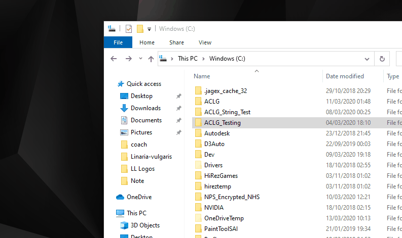
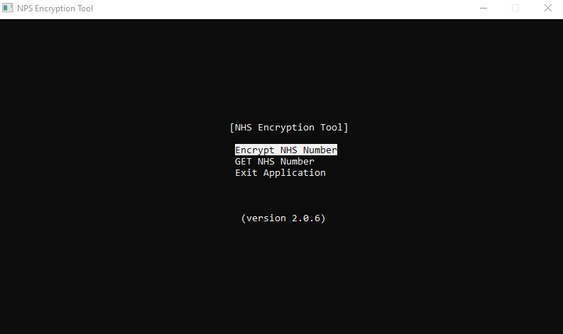

Linaria Encryption is a program that takes a string containing characters of A-Z and 0-9, and sends the encryted data to your
local machine. To retrieve the data, you can run .exe, which will display whatever data is stored locally. This info is also sent to 
your clipboard.

You can give the .exe a try via /NPS_Encryption/Program

<h2>Navigation: Use the arrow keys to move up and down then menu system.</h2>

<h2>Input: Type in some data you want to encrypt</h2>

<h2>Input Check/Confirm: If the input was OK, this data will be sent to the local file</h2>

<h2>Local Data: The folder <i>C:\NPS_Encrypted_NHS</i> will be created on your local drive, with the encrypted data.</h2>

<h2>Decrypt: To unencryted the data, select the "GET NHS Number" option. You will be displayed the data stored in the "NHS_Encrypt.txt"</h2>

